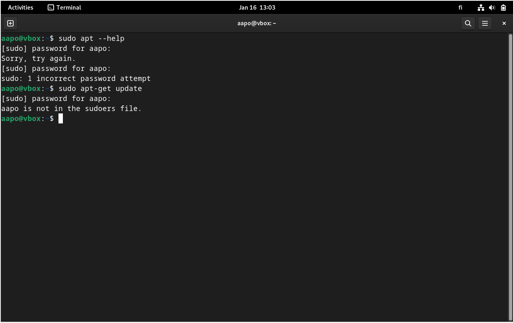
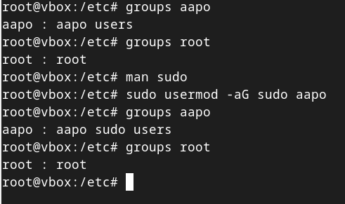
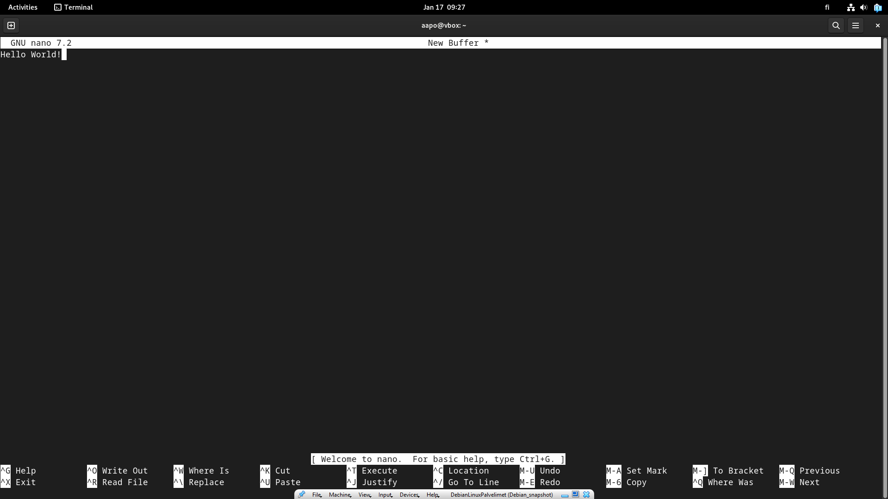
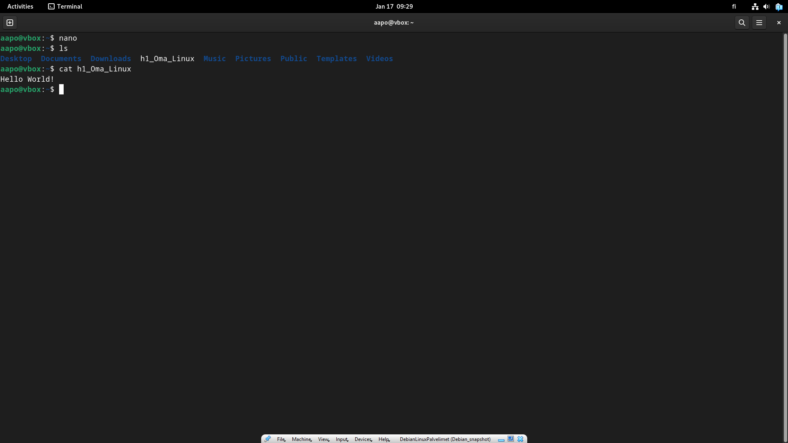

# h1 Oma Linux

## Raporttien ohjeistus tiivistettynä

- Raportin tulee olla toistettava, täsmällinen ja helppolukuinen
- Lähdeviittaukset ja vakiotekstit (lisenssin kertominen ja työn pohjana käytettävä kurssi) ilmoitetaan jokaisessa raportissa  
- Sepittäminen, plagiointi ja kuvien luvaton kopiointi työhön ovat suurimpia virheitä  
(Karvinen 4.6.2006.)

## Vapaa ohjelma (free software)

-	Vapaata ohjelmaa saa:
  >-	Ajaa käyttäjän haluamalla tavalla, riippumatta käyttäjän tarkoituksista ajaa ohjelmaa (vapaus 0)  
  >-	Lähdekoodin avoimuuden kautta oppia ohjelman toimintaa ja muuttaa lähdekoodia toimimaan haluamallaan tavalla (vapaus 1)  
  >-	Jakaa eteenpäin (vapaus 2)  
  >-	Lähdekoodin muokkaamisen jälkeen jakaa muille (vapaus 3)  
-	Ohjelma määritellään vapaaksi ohjelmaksi toteuttaessaan kaikki neljä yllä mainittua vapautta riittävällä tasolla  
(Free Software Foundation, 1.1.2024.)

## Käyttöjärjestelmät ja rauta

Olen asentanut Virtualboxin jo aikaisemmin tietokoneelleni, joten en tehnyt kyseistä vaihetta tällä kertaa ollenkaan. Ympäristönäni raportissa käytän Windows 11 Home käyttöjärjestelmää ja rautana minulla on HP 15s sarjan kannettava tietokone, joka on x64-pohjainen. Prosessorina toimii AMD64 ja RAM-muistia tietokoneessa on kokonaisuudessaan 15 712 MB. Lähiverkkoyhteytenäni toimii Wi-Fi, joka yhdistää laitteeni kotini reitittimeen. Debian versio, jonka asennan Virtualboxiin on 12.9.0.

Allokoin RAM-muistiksi 4096 MB ja prosessoreiden ytimien määräksi 4. EFI-ominaisuutta en laittanut päälle. Muistiksi allokoin 60 GB, jonka määritin dynaamisesti allokoitavaksi (”Pre-allocate Full Size” kohdan jätin valitsematta). Muistin tyypiksi valitsin VDI:n (VirtualBox Disk Image).

## Debianin asennus Virtualboxiin

Kieleksi määritin Yhdysvaltain englannin ja näppäimistöksi Suomen (ilman Windows, Mac tai ym. lisävalintoja). Sijainti tietoja en antanut jaettavaksi. En myöskään yhdistänyt tilejäni asennuksen yhteydessä, esim. Google- ja Microsoft tilejäni.

Vaihdoin tässä vaiheessa verkkoyhteyteni matkapuhelimeni tarjoamaan Wi-Fi yhteyspisteeseen, koska siirryin kodistani kirjastoon. Aloitin suorittamalla terminaalissa komennon: ”sudo apt-get update”, joka hakee listan saatavilla olevista päivityksistä (Karvinen 2024). Yrittäessäni suorittaa komentoa ”sudo apt-get update” minulle tuli virheilmoitus: ”aapo is not in the sudoers file.” Tulkitsen ongelman olevan käyttäjän ”aapo” puuttuminen sudoers tiedostosta, jolloin käyttäjällä ei ole oikeuksia suorittaa ”sudo” komentoa. Voisin suorittaa komennon ”root” käyttäjällä todennäköisesti, mutta lähden lisäämään sudo-oikeudet aapo-käyttäjälle.

## Ongelman ratkaisu

Löysin artikkelin gcore-verkkosivuilta, jossa ohjeistettiin ajamaan komento ”sudo usermod -aG sudo username”. Username kohdan tilalle kirjoitin luonnollisesti ”aapo”. Tarkistin ”groups aapo” komennolla, että kaikki on kunnossa. Hyvältä näyttää tässä vaiheessa.

Päivittäminen onnistui toimenpiteiden jälkeen. Ajoin komennon “sudo apt-get -y dist-upgrade”, mutta mitään päivityksiä ei toteutettu, koska olin juuri asentanut käyttöjärjestelmän, jolloin kaikki päivitykset olivat ajan tasalla.

## Palomuurin ja lisäominaisuuksien asentaminen

Suoritin vielä komennot: ”sudo apt-get -y install ufw” ja ”sudo ufw enable”. Ensimmäinen komento asentaa koneelle palomuurin ja jälkimmäinen kytkee palomuurin päälle. Tämän jälkeen käynnistin uudelleen Debianin, koska tehtävässä oli niin sanottu. Konetta ei tarvitsisi käynnistää uudelleen, mutta käyttäessään kerneliä ”linux-image*”, joka päivitetään myös distron päivittämisessä, pitää kone käynnistää uudelleen. (Karvinen 2024.)

Lisäksi asensin Virtualbox Guest Additions-paketin, joka mahdollisti koko näytön tilan ja host-virtual koneiden välillä leikepöydän käyttämisen. Ilman kyseisiä ominaisuuksia minulla olisi ollut todella vaikeat ajat käyttää kyseistä virtuaalikonetta, joten nämä olivat erittäin hyödylliset ja tarpeelliset ominaisuudet.

## Bonus tehtävä

Lempiohjelmani Linuxilla on Nano tekstieditori. Nanon sain avattua kirjoittamalla terminaaliin ”nano”. Kirjoitin tekstin editoriin, jonka jälkeen CTRL + O-näppäinyhdistelmällä annoin tiedostolle nimen ja tallensin sen Enter-näppäimellä.

CTRL + X-näppäinyhdistelmällä suljin editorin, jonka jälkeen avasin terminaalissa vielä kirjoittamani tekstin cat-komennolla.

Nanoa en osaa vielä hyödyntää tästä enempää ja olen kuullut Vi-tekstieditorin olevan joissain tapauksissa vielä hyödyllisempi, joten opeteltavaa on molemmissa vielä.
 
 
## Lähteet

Free Software Foundation. 1.1.2024. What is Free Software? Luettavissa: https://www.gnu.org/philosophy/free-sw.html. Luettu: 15.1.2025.

Gcore. 22.8.2023. How to Add User to Sudoers in Debian. Luettavissa: https://gcore.com/learning/how-to-add-user-to-sudoers-in-debian/. Luettu: 16.1.2025.

Karvinen, T. 4.6.2006. Raportin kirjoittaminen. Luettavissa: https://terokarvinen.com/2006/raportin-kirjoittaminen-4/. Luettu: 15.1.2025.

Karvinen, T. 26.9.2024. Install Debian on Virtualbox - Updated 2024. Luettavissa: https://terokarvinen.com/2021/install-debian-on-virtualbox/. Luettu: 16.1.2025.
 
 
 
 
 
 
*Tätä dokumenttia saa kopioida ja muokata GNU General Public License (versio 3 tai uudempi) mukaisesti. http://www.gnu.org/licenses/gpl.html*  
*Pohjana Tero Karvinen 2025: Linux Palvelimet 2025 alkukevät, https://terokarvinen.com/linux-palvelimet/*
