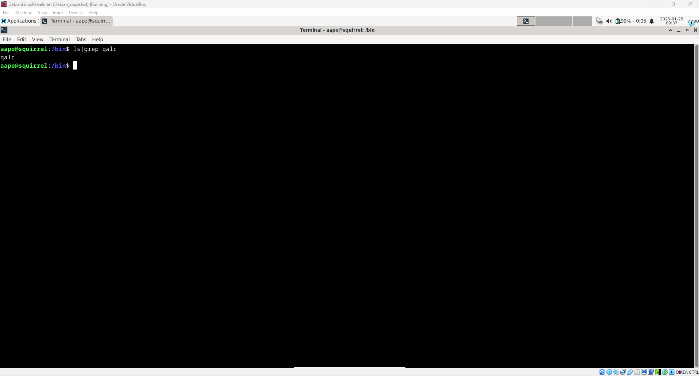

*Tekijä: Aapo Tavio*

# h2 Komentaja Pingviini

•	Linuxissa ja BSD:ssä käytetty komentorivikehote on helppokäyttöinen, nopea, ilmaiseva ja helppo automatisoida  
•	Kyseinen komentorivikehote on myös todettu pitkän historian aikana hyväksi, koska sitä käytetään edelleen
(Karvinen, T. 2020. https://terokarvinen.com/2020/command-line-basics-revisited/?fromSearch=command%20line%20basics%20revisited)  
•	Omana huomiona kirjoituksessa mielenkiintoni kohdistui erityisesti scp-komennon avulla kansioiden kopioimiseen etäyhteydellä koneiden välillä  
•	Olen itse aikaisemmin kopioinut kansioita kahden tietokoneen välillä vain käänteisen shellin (recursive-shell) ja bind shellin avulla, käyttäen komentoa ”wget”. Nämä tavat perustuu koneiden väliseen aktiiviseen yhteyteen esim. netcat sovelluksen ja python web-palvelun avulla.  

## Käytettävän ympäristön ominaisuudet

- Isäntä:
  >- HP Laptop 15s-eq3xxx  
  >- Microsoft Windows 11 Home (versio 24H2)  
  >- AMD Ryzen 7 5825U, Radeon Graphics  
  >- 16 GB RAM (15,3 GB käytettävissä)
  >- x64-pohjainen
  >- Verkkokorttina Realtek WiFi 6

- Virtuaalikone
  >- Debian GNU/Linux 12 (bookworm) xfce
  >- Virtualbox

## Micro-editorin asennus

Käytettävä verkko: kodin LAN reitittimen kautta (kunnes toisin sanotaan).  

Tehtävän ohjeissa kehotettiin asentamaan micro-editori, mutta olen asentanut kyseisen editorin jo aikaisemmin. Editori ladataan ja asennetaan komennoilla ”sudo get-apt update” ja ”sudo get-apt install micro”. Varmistin micron olemassaolon vielä antamalla komennon micro, jonka jälkeen editori avautui, kuten kuuluikin.

## Ensimmäinen uusi ohjelma komentoriville

24.1.2025 klo 16.00:  
Asennan kolme itselleni uutta komentoriviohjelmaa Debian koneelleni. Aloitan päivittämällä paketit komennolla ”sudo apt-get update”. Tämän jälkeen hain komennolla ”apt-cache search games” pelejä, joita voin ladata. Tuloksia oli niin paljon, että etsin selaimellakin pelejä.  

24.1.2025 klo 16.45:  
Löysin it’s foss-sivustolta (https://itsfoss.com/best-command-line-games-linux/) pelin nimeltä bastet, joka on tetriksen kaltainen. Etsin pelin komennolla ”apt-cache search bastet”, joka löytyikin. Seuraavaksi tarkistin ”apt-cache show bastet” -komennolla vielä, että kyseessä on oikea peli. Asennan pelin komennolla ”sudo apt-get -y install bastet”.  

Etsin komennolla ”find /|grep bastet|less” hakemiston, jossa kyseinen peli sijaitsee. Peli sijaitsee /usr/games hakemistossa. Käynnistin pelin menemällä kyseiseen hakemistoon ja antamalla komennon bastet.

## Toinen uusi ohjelma komentoriville

24.1.2025 klo 17.00:  
Opettaja Tero Karvinen mainitsi materiaaleissa ”nethack” nimisen pelin, joten olihan sitä kokeiltava (https://terokarvinen.com/2020/command-line-basics-revisited/?fromSearch=command%20line%20basics%20revisited). Latasin nethack pelin komennolla ”sudo apt-get -y install nethack-console”, jonka jälkeen koitin peliä. Vaikutti mielenkiintoiselta, vaikka ymmärsin lähinnä vain profiilini pelistä.

## Kolmas uusi ohjelma komentoriville

25.1.2025 klo 8.45:  
Aloitin ajamalla ensin komennon ”sudo apt-get update”, koska edellisestä oli kulunut jo paljon aikaa. Tämän jälkeen katsoin githubista mielenkiintoisen laskinsovelluksen Qalculaten ”libqalculate” reposta (https://github.com/Qalculate/libqalculate). Tarkistin saatavuuden komennolla ”apt-cache search qalculate” ja asensin laskinsovelluksen komennolla ”sudo apt-get -y install qalc”.  

Tämän jälkeen kokeilin ohjelmaa ajamalla komennon ”qalc” yksinkertaisilla laskutoimituksilla ja ohjelmahan vaikuttaa aivan mahtavalta! Sovellus on todella helppokäyttöinen.

Kaikkien kolmen ohjelman asentaminen yhdellä komennolla tulisi muotoon: ”sudo apt-get -y install bastet nethack-console qalc”.

## Filesystem Hierarchy Standard (FHS)

25.1.2025 klo 9.15:  
Suoritin komentoja, joilla esittelin tärkeitä hakemistoja hakemistopuusta. Kuvat prosesseista ovat alla:

Juurihakemisto

/home/aapo/ hakemisto

/etc/ hakemisto

/etc/hostname tiedosto avattuna

/media/ hakemisto

/var/log/ hakemisto

/var/log/README tiedosto avattuna

## Grep-komento ja putket

Seuraavaksi oli vuorossa grep-komennon havainnollistaminen, joka näkyy alla olevissa kuvissa. Valinta -w tarkoittaa, että halutaan tietty sana etsiä tarkalleen ottaen, kuten sen kirjoitamme. Valinta -r tarkoittaa, että etsiminen tapahtuu rekursiivisesti myös kaikista alikansioista. (https://geekflare.com/dev/grep-command-examples/). Putken käyttö näkyykin esim. ”ls|grep qalc” komennossa.

## Rauta

25.1.2025 klo 10.45:  
Asensin lshw-ohjelman komennolla ”sudo apt-get -y install lshw” ja listasin virtuaalikoneeni raudan komennolla ”sudo lshw -short -sanitize”. Listassa näkyy mm. virtualisointialustani ”system”-kohdassa, ”memory”-kohdassa keskusmuistini määrä allokoituna virtuaalikoneelleni, verkkoadapterini ”network”-kohdassa ja allokoimani ei-volatiilinen muisti.

 
 

## Lähteet

Karvinen, T. 3.2.2020. Command Line Basics Revisited. Luettavissa: https://terokarvinen.com/2020/command-line-basics-revisited/?fromSearch=command%20line%20basics%20revisited. Luettu: 25.1.2025.  

Prakash, A. 25.5.2023. Top 10 Command Line Games for Linux. Luettavissa: https://itsfoss.com/best-command-line-games-linux/. Luettu: 24.1.2025.  

Qalculate. 19.1.2025. libqalculate. Luettavissa: https://github.com/Qalculate/libqalculate. Luettu: 25.1.2025.  

Nair, A. 23.12.2024. 16 grep Command Examples to Help You in Real-World. Luettavissa: https://geekflare.com/dev/grep-command-examples/. Luettu: 25.1.2025.
 
 
 
 
 
 
*Tätä dokumenttia saa kopioida ja muokata GNU General Public License (versio 3 tai uudempi) mukaisesti. http://www.gnu.org/licenses/gpl.html*  
*Pohjana Tero Karvinen 2025: Linux Palvelimet 2025 alkukevät, https://terokarvinen.com/linux-palvelimet/*
