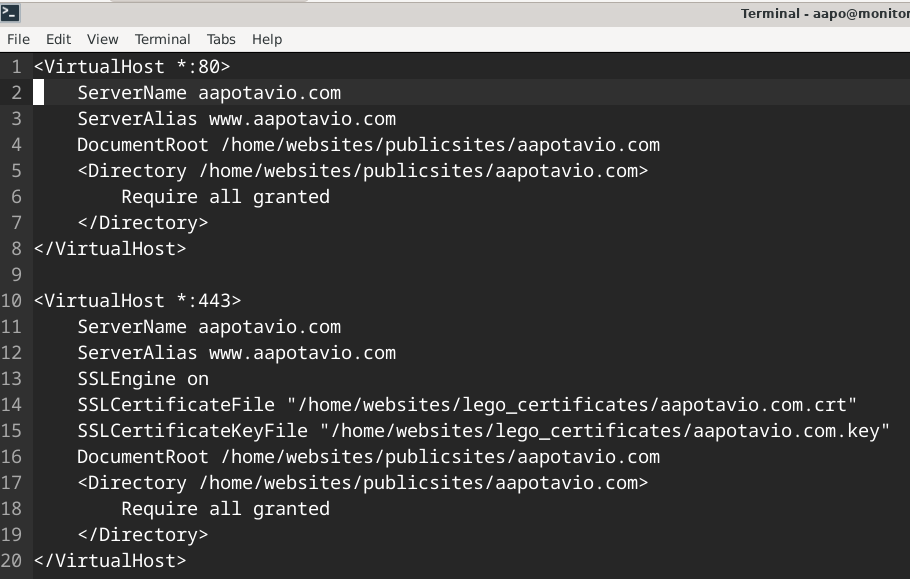
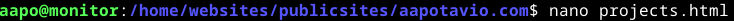

*Tekijä: Aapo Tavio*

# h5 Nimekäs

Tehtävässä ostin domainin ja yhdistin sen ohjaamaan liikenteen DigitalOcean-palvelusta vuokraamalleni virtuaaliselle palvelimelle. Lisäksi konfiguroin alidomaineja, name based virtual host palveluita ja tutkin nimikyselyiden tietoja "host" ja "dig" -komennoilla. Etsin tietoa myös uusista asioista ja käsitteistä, joita minulle tuli tehtävän aikana vastaan.

## Käytettävän ympäristön ominaisuudet

- Isäntä:
  >- HP Laptop 15s-eq3xxx  
  >- Microsoft Windows 11 Home (versio 24H2)  
  >- AMD Ryzen 7 5825U, Radeon Graphics  
  >- 16 GB RAM (15,3 GB käytettävissä)
  >- x64-pohjainen
  >- Verkkokorttina Realtek WiFi 6

- Virtuaalikone
  >- Debian GNU/Linux 12 (bookworm) xfce
  >- Virtualbox

Verkko yhteytenä minulla oli tehtävässä kotini reitittimen kautta tuleva valokuitu 200Mb/s nopeudella.  
Suoritin domainin ostamisen isäntäkoneella ja isäntäkoneen virtuaalikoneella otin yhteyden ssh:lla maksulliseen virtuaaliserveriin, jonka vuokrasin edellisessä tehtävässä h4 Maailma Kuulee.

## a)  
### Domainin ostaminen ja konfigurointi
Aloitin tehtävän ostamalla domainin Namecheap.com osoitteesta, jota suositeltiin tunnilla yhtenä hyvänä vaihtoehtona. Valitsin aapotavio.com, joka oli vapaana.

Muistelin tunnilta, että tietueita oli aseteltava Namecheapin valikoissa, mutta en muistanut, miten tämä tehtiin? Löysin Namecheapin ohjeista hyvät ohjeet tietueiden konfiguroimiseen (Namecheap, URL: https://www.namecheap.com/support/knowledgebase/article.aspx/319/2237/how-can-i-set-up-an-a-address-record-for-my-domain/).

Olimme käyneet aikaisemmin Windows-palvelimet kurssilla läpi erilaisia tietueita ja mitä ne tarkoittavat, mutta en muistanut juurikaan mitään asiasta, koska kurssista on aikaa ja kyseisiä asioita ei ole tultu käsiteltyä kovinkaan usein. Luin siis tekstipätkän A-tietueista, jossa kerrottiinkin A-tietueiden olevan IPv4-osoitteille ja niiden kertovan domainiin kuuluvan IP-osoitteen (Cloudflare, URL: https://www.cloudflare.com/learning/dns/dns-records/dns-a-record/). Lisäsin itselleni A-tietueet osoitteisiin ”aapotavio.com” ja ”www.aapotavio.com” sekä TTL (Time To Live) arvon 5 minuuttiin.

En lisännyt AAAA-tietueita, koska minulla ei ole IPv6-osoite päällä VPS-koneessani, mutta ehkäpä laitan tämän joskus päälle.

## b)	14.2.2025 Klo 12.56  
Aloitin tehtävät päivittämällä ensin paikallisen virtuaalikoneeni, joten komento ”sudo apt-get update” ja ”sudo apt-get -y dist-upgrade”. Tämän jälkeen otin yhteyden digitaloceanista vuokraamaani virtuaaliseen koneeseen komennolla ”ssh aapo@142.93.132.235”. Tarkastin myös, että unattended-upgrade toiminto on myös päällä tiedostopolusta: ”/var/log/unattended-upgrades/unattended-upgrades.log”. Päällähän se oli.

14.2.2025 Klo 13.25  
Tavoitteeni oli luoda Name Based Virtual Host näkymään ostetussa domainissani. Ensimmäiseksi loin konfigurointitiedoston aapotavio.com.conf komennolla ”sudoedit aapotavio.com.conf” ollessani polussa /etc/apache2/sites-available.

Seuraavaksi tein polkuun /home/websites/publicsites uuden hakemiston komennolla ”sudo mkdir aapotavio.com”. Yritin ensimmäiseksi ilman sudoa eli ”mkdir aapotavio.com”, mutta vastauksena tuli ”Permission denied”.

Seuraavaksi oli vuorossa index.html-tiedoston luonti polussa /home/websites/publicsites/aapotavio.com komennolla ”micro index.html”. Minulla ei ollut oikeuksia hakemistoon, joten micro-editori kysyi, haluanko tallentaa sudo-oikeuksin tiedoston? Vastasin myöntävästi.

14.2.2025 Klo 13.58  
Seuraavaksi minun piti antaa oikeudet käyttäjälleni hakemistoon aapotavio.com, joten tarkastelin edellisen viikon raporttia githubista muistin virkistämiseksi (Tavio, URL: https://github.com/apeeqq/linux-servers/blob/main/h4-maailma-kuulee.md). Muutin hakemiston omistajuuden root-käyttäjältä aapo-käyttäjälle. Siispä komentona oli ”sudo chown -R aapo /home/websites/publicsites/aapotavio.com/”.

Testasin vielä, että pystyn ilman sudon oikeuksia muokkaamaan tiedostoa index.html. Muokkaaminen onnistui, mutta tajusin prosessin jälkeen, että parempi toteuttamisjärjestys olisi ollut ensiksi muuttaa kansion omistajuutta ja sitten vasta tehdä tiedosto index.html. Seuraavalla kerralla asia pitäisi muistaa.

Siirryin hakemistoon /etc/apache2/sites-enabled, jossa suoritin komennon ”sudo a2dissite new.com.conf”, koska halusin vanhan sivun pois päältä ennen uuden laittamista päälle.

Joten luonnollisesti tämän jälkeen komento ”sudo a2ensite aapotavio.com.conf”, jolla laitoin uuden sivuni päälle. Lopuksi vielä apachen uudelleenkäynnistys komennolla ”sudo systemctl restart apache2”.

## c)	14.2.2025 Klo 14.29
Tässä kohdassa tavoitteeni oli saada kaksi sivua lisää kotisivuilleni, jolloin niitä olisi kolme. Minun piti vielä linkittää kaikki sivut yhteen ja tehdä sivuista validia HTML:ää.

Lähdin tekemään tiedostoja hakemistoon  /home/websites/publicsites/aapotavio.com/, joten komento ”cd /home/websites/publicsites/aapotavio.com/”. Komennolla ”micro blog.html” loin alasivun blogille.

Komennolla ”micro projects.html” yritin useaan kertaan luoda tiedostoa, mutta jostain tuntemattomasta syystä en saanut kopioitua html-koodini pohjaa tiedostoon, joten päätin tehdä asian nanolla. Eli ”nano projects.html” komennolla loin tiedoston.

Minun pitää selvittää asia myöhemmin, mutta se ei ole olennainen tekijä tällä hetkellä.

Alla olevassa kuvassa näkyy luomani tiedostot polkuun /home/websites/publicsites/aapotavio.com oikeuksien kera.

Päätin muuttaa index.html-tiedoston ryhmäoikeudet root-ryhmältä aapo-ryhmälle, jotta tiedostoista tulee johdonmukaisia. Polussa /home/websites/publicsites/aapotavio.com komento ”chown aapo:aapo index.html”.

Käytin lähteenäni terminaalin --help valintaa komennolla ”chown --help”.

14.2.2025 Klo 17.35  
Sivujen linkittäminen toisiinsa oli vielä tehtävä, koska unohdin asian kirjoittaessani html-koodia. En muistanut miten linkittäminenkin tehtiin, joten katsoin GeeksforGeeks:n artikkelista asian (URL: https://www.geeksforgeeks.org/how-to-link-two-pages-in-html/). Aloitin index.html-tiedostosta linkittämisen, koska tällöin voin testata asteittain linkityksen toimimisen, koska index.html-tiedoston sivu tulee ensiksi sivuillani aina näkyviin.

Joten polussa /home/websites/publicsites/aapotavio.com komento ”nano index.html”. Tein body-elementtiin muutoksen tekemällä paragraph-elementin, jonka sisään tein ankkurielementtejä, kuten alla olevasta kuvasta näkyy.

Sivu toimi odotetusti.

Oli vuoro siirtyä blog.html-tiedoston pariin. Samalla kaavalla polussa /home/websites/publicsites/aapotavio.com komento ”nano blog.html” ja samanlainen rivi kyseiseen tiedostoon, kuin index.html-tiedostoonkin.

## d)	15.2.2025 Klo 8.25  
Tehtävässä minun tuli tehdä alidomain (subdomain). En tiennyt miten tehdä alidomain, joten luin ohjeet Namecheapin sivuilta (https://www.namecheap.com/support/knowledgebase/article.aspx/9776/2237/how-to-create-a-subdomain-for-my-domain/). Päätin tehdä tehtävän vapaaehtoisena versiona, eli luoda toinen alidomain A-tietueella ja toinen CNAME-tietueella. Luin Cloudflaren artikkelista, mitä tarkoittaa CNAME-tietue (https://www.cloudflare.com/learning/dns/dns-records/dns-cname-record/)? CNAME-tietue osoittaa siis toiseen domainiin, eikä IP-osoitteeseen, kuten A-tietue.

Tein A-tietueen alidomainille blog.aapotavio.com ja CNAME-tietueen alidomainille projects.aapotavio.com.

Lisäksi tein toisen vapaaehtoisen tehtävän, jossa konfiguroin name based virtual hostin alidomaineille.

Aloitin tehtävän tekemällä oman konfigurointitiedoston alidomainilleni blog.aapotavio.com.conf komennolla ”sudoedit blog.aapotavio.com.conf” ollessani polussa /etc/apache2/sites-available.

Tajusin tässä vaiheessa, että todennäköisesti minun pitää lisätä uudet tietueet vielä alidomaineille, joissa sisältyy alussa ”www”. En tee sitä vielä, koska yksi vaihe kerrallaan.

Huomasin myös tässä vaiheessa, että en tiennyt miten konfiguroidaan toisen tiedoston valitseminen samasta hakemistosta, koska nyt alidomainin konfigurointitiedosto lataa automaattisesti oletuksena index.html-tiedoston ensimmäiseksi.

Etsin tietoa netistä ja löysinkin sitä apachen verkkosivuilta (https://httpd.apache.org/docs/2.4/mod/mod_dir.html). Minun piti lisätä konfigurointitiedostoon ”DirectoryIndex blog.html”.

15.2.2025 Klo 10.01  
Lisättyäni tiedostoon rivin, käynnistin apachen uudelleen ”sudo systemctl restart apache2”. Uudelleenohjaus ei toiminut ja huomasin heti unohtaneeni komennon ”sudo a2ensite blog.aapotavio.com.conf” ja taas apachen käynnistys uudelleen.

Nyt toimi!

Seuraavaksi sama prosessi toiselle alidomainilleni projects.aapotavio.com, joten polussa /etc/apache2/sites-available komento ”sudoedit projects.aapotavio.com.conf”. Sitten tiedostoon oikeat tiedot

ja komennot ”sudo a2ensite projects.aapotavio.com.conf” sekä ”sudo systemctl restart apache2”. Sivu toimi odotetusti,

mutta huomasin unohtaneeni lisätä linkitykset muihin sivuihin projects-sivulleni, joten lisäsin nekin tässä vaiheessa.

Kokeilin vielä selaimessa toimivuutta ja toimihan se.

Kokeilin tehdä selaimella pyynnön sivulle ”www.blog.aapotavio.com”, mutta se ei toiminut, joten päätin tehdä vielä molemmille alidomaineilleni uudet tietueet, jotta kyseisillä hakupyynnöillä pääsee sivuilleni.

## e)	15.2.2025 Klo 11.51  
Tein tämän kohdan tehtävät paikallisella virtualbox debian virtuaalikoneellani.

Tehtävässä oli tarkoituksena katsoa DNS-kyselyitä ja tulkita sekä vertailla niitä. Aloitin tekemällä komennon ”dig aapotavio.com ANY”, koska katsoin ohjeita GeeksforGeeks:n sivuilta, miten saisin tarvittavat tiedot näkymään kyselyssä (https://www.geeksforgeeks.org/dig-command-in-linux-with-examples/).

Keskityin ”answer section” kohtaan, koska se kertoo nimipalvelimelta tulleet tiedot (globalping, URL: https://blog.globalping.io/how-to-read-a-dig-result-a-guide-for-network-novices/).

Stack overflow-sivustolta löytyikin lisätietoa answer-kohdan arvoista (https://stackoverflow.com/questions/20297531/meaning-of-the-five-fields-of-the-answer-section-in-dig-query). Ensimmäinen kenttä on domain, joka palautettiin (minulla kaikissa kolmessa: aapotavio.com). Seuraava kenttä kertoo TTL-arvon (Time-To-Live), joka minulla oli kahdessa ensimmäisessä vastauksessa 1772 ja kolmannessa 272. TTL-arvo ilmaistaan sekunneissa. IN-arvo kertoo luokan. IN tulee sanasta internet. Luokan oikealla puolella oleva arvo kertoo tyypin. A-tietue kertoo vastauksen olevan IPv4-osoite, joka on johdettu domainin nimestä. NS-arvo kertoo vastauksen olevan nimipalvelimesta, joka selvittää haluttua kyselyä (ClouDNS, https://www.cloudns.net/wiki/article/34/). Viimeinen kenttä vasemmalta kertoo vastauksen lähettäneen IP-osoitteen tai domain nimen.

Namecheapin web-liittymästä näkyykin, että vastausten nimipalvelimet tulevat Namecheapin nimipalvelimista, jotka ovat oletuksena päällä.

Komennolla ”host -a aapotavio.com” DNS-kyselyn vastaus muuttuikin oleellisesti tietueen ja IP-osoitteen/domainin kohdissa.

Tietueessa lukee ”HINFO” ja sitä seuraa merkintä ”RFC8482”. Selviteltyäni netistä asiaa, vaikuttaa HINFO-tietueen ilmaisevan ANY-tietueen kyselyiden estämistä. HINFO on määritelty kyseisessä RFC8482 dokumentissa (Abley ym. URL: https://datatracker.ietf.org/doc/html/rfc8482 ja Majkowski, URL: https://blog.cloudflare.com/rfc8482-saying-goodbye-to-any/).

Komennolla ”host aapotavio.com” tulee puolestaan erilainen vastaus.

Myös ”host -v aapotavio.com” tuottaa vielä erilaisen vastauksen.

Näiden perusteella voidaan sanoa, että ”eforward…” domainit ovat MX-tietueita (Mail Exchange), jotka liittyvät domainin käyttämiin sähköpostipalvelimiin. Luku ennen palvelimen nimeä ilmaisee sähköpostien käsittelyn etusijoja. Mitä pienempi luku, sitä ensisijaisempi käsittelyjärjestys sähköposteille. (Zivanov, URL: https://phoenixnap.com/kb/linux-host.) Lisäksi AAAA-tietue kertoo IPv6:n käytöstä, mutta vastauksia näyttää olevankin siinä 0, kuten pitääkin. Oletan asian ilmaisevan, että minun domain ei tue IPv6 nimikyselyitä.

15.2.2025 Klo 17.18  
Minun piti valita jokin pieni yritys, kerho tai henkilön verkkosivut, jotka katson dig ja host ohjelmilla. Valitsin Impivaaran Tenniskeskuksen, jonka domain on jarkkonieminenareena.fi.

SOA (start of authority record) on tietue, joka on kuvattu RFC 1035 dokumentissa. Kyseinen tyyppi hallitsee DNS-servereiden alueiden välisiä siirtoja ja ”ns1.sigmatic.fi” on alueen ensisijaisen palvelimen nimi.

”hostmaster.jarkkonieminenareena.fi” on RNAME-tieto, joka kertoo alueen ylläpitäjän sähköpostiosoitteen. Asia voitaisiin ilmaista myös ”hostmaster@jarkkonieminenareena.fi”, mutta SOA-tietueessa asia ilmaistaan ilman @-merkkiä. (Cloudflare Inc. URL: https://www.cloudflare.com/learning/dns/dns-records/dns-soa-record/.)

Seuraava luku ”2024101803” tarkoittaa alueen sarjanumeroa.

”28800” luku ilmaisee päivitysajan sekunneissa, jonka kuluttua toissijaisten nimipalvelimien on päivitettävä tietonsa ensisijaiselta nimipalvelimelta.

”7200” kertoo uudelleenyritys (retry) ajan sekunneissa, jonka jälkeen on toissijaisen nimipalvelimen koitettava päivittää sarjanumero uudestaan, jos ensisijainen nimipalvelin ei ole vastannut pyyntöihin.

”604800” on umpeutumisaika (expire), jonka jälkeen toissijaisen nimipalvelimen on lakattava vastaamasta alueelle tuleviin pyyntöihin, jos ensisijainen nimipalvelin ei vastaa pyyntöihin.

”600” on minimi aika, josta saadaan time-to-live arvon kanssa laskettua negatiivisten vastausten säilytyksen aika. (Wikipedia, URL: https://en.wikipedia.org/wiki/SOA_record.)

Host-kyselyistä tenniskeskuksen sivuille ei tule juuri mitään uutta tietoa, paitsi MX-tietueen sähköpostipalvelin, joka on ”mail1.sigmatic.fi”.

15.2.2025 Klo 18.07  
Lopuksi tehtävänä oli vielä tehdä kyselyt suurelle ja kaikkien tuntemalle palvelulle. Valitsin tekeväni kyselyt applelle.

Mitään uusia tietuetyyppejä ei ilmaantunut, eikä muutenkaan mitään arvojen lajeja, joita en ole avannut jo aikaisemmin.

Host-kyselyssäkään ei tule mitään uutta applen kohdallakaan, paitsi MX-tietueet.

 
 

## Lähteet

Abley, J., Gudmundsson, O., Majkowski, M. & Hunt, M. 2019. Luettavissa: https://datatracker.ietf.org/doc/html/rfc8482. Luettu: 15.2.2025.

Cloudflare Inc. What is a DNS A record? Luettavissa: https://www.cloudflare.com/learning/dns/dns-records/dns-a-record/. Luettu: 14.2.2025.

Cloudflare Inc. What is a DNS CNAME record? Luettavissa: https://www.cloudflare.com/learning/dns/dns-records/dns-cname-record/. Luettu: 15.2.2025.

Cloudflare Inc. What is a DNS SOA record? Luettavissa: https://www.cloudflare.com/learning/dns/dns-records/dns-soa-record/. Luettu: 15.2.2025.

ClouDNS 2024. What is an NS Record? Set Up Your DNS Name Servers. Luettavissa: https://www.cloudns.net/wiki/article/34/. Luettu: 15.2.2025.

Debian terminaalin ”chown --help” dokumentaatio. Luettu: 14.2.2025.

GeeksforGeeks 2024. dig Command in Linux with Examples. Luettavissa: https://www.geeksforgeeks.org/dig-command-in-linux-with-examples/. Luettu: 15.2.2025.

GeeksforGeeks 2024. How To Link Two Pages In HTML ? Luettavissa: https://www.geeksforgeeks.org/how-to-link-two-pages-in-html/. Luettu: 14.2.2025.

Globalping 2023. How to Read a Dig Result: A Guide for Network Novices. Luettavissa: https://blog.globalping.io/how-to-read-a-dig-result-a-guide-for-network-novices/. Luettu: 15.2.2025.

Majkowski, M. 2019. RFC8482 - Saying goodbye to ANY. Luettavissa: https://blog.cloudflare.com/rfc8482-saying-goodbye-to-any/. Luettu: 15.2.2025.

Namecheap Inc. 2024. How can I set up an A (address) record for my domain? Luettavissa: https://www.namecheap.com/support/knowledgebase/article.aspx/319/2237/how-can-i-set-up-an-a-address-record-for-my-domain/. Luettu: 14.2.2025.

Namecheap Inc. 2024. How to Create a Subdomain for my Domain. Luettavissa: https://www.namecheap.com/support/knowledgebase/article.aspx/9776/2237/how-to-create-a-subdomain-for-my-domain/. Luettu: 15.2.2025.

Stack Overflow 2016. Meaning of the five fields of the ANSWER SECTION in dig query. Luettavissa: https://stackoverflow.com/questions/20297531/meaning-of-the-five-fields-of-the-answer-section-in-dig-query. Luettu: 15.2.2025.

Tavio, A. h4 Maailma kuulee. Luettavissa: https://github.com/apeeqq/linux-servers/blob/main/h4-maailma-kuulee.md. Luettu: 14.2.2025.

The Apache Software Foundation. Apache Module mod_dir. Luettavissa: https://httpd.apache.org/docs/2.4/mod/mod_dir.html. Luettu: 15.2.2025.

Wikipedia 17.1.2025. SOA record. Luettavissa: https://en.wikipedia.org/wiki/SOA_record. Luettu: 15.2.2025.

Zivanov, S. 24.10.2023. Linux host Command with Examples. Luettavissa: https://phoenixnap.com/kb/linux-host. Luettu: 15.2.2025.
 
 
 
 
 
 
*Tätä dokumenttia saa kopioida ja muokata GNU General Public License (versio 3 tai uudempi) mukaisesti. http://www.gnu.org/licenses/gpl.html*  
*Pohjana Tero Karvinen 2025: Linux Palvelimet 2025 alkukevät, https://terokarvinen.com/linux-palvelimet/*
