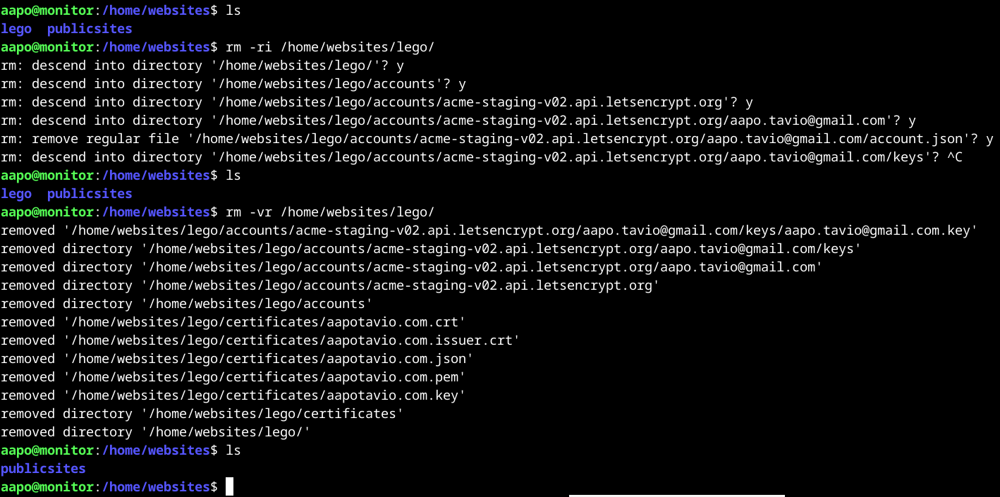
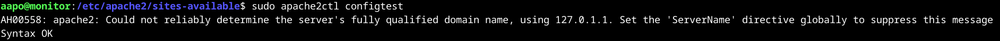
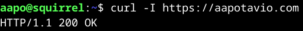

*Tekijä: Aapo Tavio*

# h6 Salataampa

Tehtävässä hankin domainilleni TLS-sertifikaatin Let's Encryptiltä Legon avulla. Lisäksi asetin sertifikaatin uusimisen automaattisesti script-tiedoston ja crontabin avulla sekä testasin web-sovelluksella minun domainin salatun yhteyden.

## x)

- Sertifikaattihallinnoija
  >- Todistaa sertifikaattia tarjoavalle yritykselle (Certificate Authority, CA) web-palvelimen oikeudesta hallinnoida tiettyä domainia
  >- Todistusprosessin jälkeen sertifikaattihallinnoija voi pyytää, uusia ja poistaa sertifikaatteja domainista, jota web-palvelin hallinnoi
- Sertifikaattihallinnoija ja CA todentavat toisiaan julkisen avaimen infrastruktuurilla (Public Key Infrastructure, PKI) sekä CA:n määrittelemillä tehtävillä, jotka web-palvelimen tulee suorittaa

(Internet Security Research Group. URL: https://letsencrypt.org/how-it-works/)

 

- Olemassa olevalla web-palvelimella voi varmentaa domainin käyttämällä legoa sertifikaattihallinnoijana
- On tärkeätä muistaa sisällyttää asetuksiin valinta, jolla voidaan hoitaa varmistustehtävä, joka annetaan CA:n toimesta.
  >-Esim. --http.webroot valinta tiedostoon, jolla on tarkoitus hoitaa CA:n edellyttämä tehtävä domainin varmistamisesta olemassa olevalla web-palvelimella.

(Lange. URL: https://go-acme.github.io/lego/usage/cli/obtain-a-certificate/index.html#using-an-existing-running-web-server)

 

- Apache demonilla käytettäessä name based virtual hostia, on virtual host tiedostoon lisättävä:
 >-SSLEngine
 >-SSLCertificateFile
 >-SSLCertificateKeyFile

(The Apache Software Foundation. URL: https://httpd.apache.org/docs/2.4/ssl/ssl_howto.html#configexample)

## Käytettävän ympäristön ominaisuudet

- Isäntä:
  >- HP Laptop 15s-eq3xxx  
  >- Microsoft Windows 11 Home (versio 24H2)  
  >- AMD Ryzen 7 5825U, Radeon Graphics  
  >- 16 GB RAM (15,3 GB käytettävissä)
  >- x64-pohjainen
  >- Verkkokorttina Realtek WiFi 6

- Paikallinen virtuaalikone
  >- Debian GNU/Linux 12 (bookworm) xfce
  >- Virtualbox

## a)	28.2.2025 Klo 14.06
Verkkoyhteytenä minulla on WiFi yhteyspiste puhelimesta. Operaattorina toimii Telia ja ilmoitettu latauksen maksimitiedonsiirtonopeus on 300 Mb/s.

## Alkutestaus ja legon asentaminen

Aloitin päivittämällä paikallisen debian virtuaalikoneeni, kuten aina. Komennot ”sudo apt-get update” ja ”sudo apt-get dist-upgrade”. Sitten kirjautuminen etäpalvelimelleni, joka on vuokrattu Digitalocean palvelusta, käyttämällä vuokrattua domainiani namecheapista komennolla ”ssh aapo@aapotavio.com”.

Ensimmäiseksi minun on opettajan ohjeiden mukaan käynnistettävä apache-demoni uudelleen ja kokeiltava, että web-sivuni toimii (Karvinen. URL: https://terokarvinen.com/linux-palvelimet/#h6-salataampa). Ensiksi siis komento ”sudo systemctl restart apache2”.

Tämän jälkeen oli vuorossa verkkosivuni testaaminen, jonka tein paikallisella virtuaalikoneellani. Komennolla ”curl aapotavio.com” tulikin vastaus, jota odotinkin.

Lisäksi testasin sivun toimimisen host-koneeni selaimella (windows-kone). Ja toimihan se.

Minun oli asennettava lego-ohjelma koneelleni, joka on siis sertifikaattien hallinnoimiseen tehty ohjelma. Komennot ”sudo apt-get update” ja ”sudo apt-get install lego”.

 
 

## Testiympäristössä sertifikaatin hankkiminen
**28.2.2025 Klo 15.55**  
Ensimmäiseksi aloitin tekemään uuden hakemiston lego-sertifikaateilleni. Polussa /home/websites komento ”mkdir lego”, jolla sain hakemiston luotua.

Aloitin testaamisen Let’s Encryptin staging-ympäristöstä, jossa saa testata toimiiko sertifikaatin pyyntöön tarkoitettu prosessi testausympäristössä turvallisesti. Tämän jälkeen on sitten aika pyytää sertifikaatteja tuotantoympäristössä, jolloin ne tunnistetaan aidoksi sertifikaateiksi julkisesti. (Internet Security Research Group. URL: https://letsencrypt.org/fi/docs/staging-environment/.)

Yliviivasin tietoturvasyistä sähköpostiosoitteeni punaisella värillä.

Testaus onnistui ja päätinkin vielä tarkistaa, että minulle oli ilmestynyt tietoja lego-hakemistooni. Sinne olikin tosiaan ilmestynyt hakemistoja ja tiedostoja kuten alla olevasta kuvasta näkyy. Polkuun /home/websites/lego/ oli luotu automaattisesti hakemistot accounts ja certificates. Hakemisto accounts sisälsi vielä yhden alihakemiston. Hakemisto certificates sisälsi vain tiedostoja.

 
 

## Tuotantoympäristössä sertifikaatin hakeminen
**28.2.2025 Klo 18.43**  
Verkkoyhteyteni vaihtui tässä vaiheessa kotini reitittimen kautta tulevaan valokuituun maksimilatausnopeutena 200 Mb/s.

Poistin seuraavaksi hakemiston lego, polusta /home/websites/, joka sisälsi staging-vaiheen testitietoja. Näin ollen asioihin sai selkeyttä, koska tarpeettomat testitiedot eivät olleet enää koneella.

Kokeilin mielenkiinnosta v ja i -valintoja rm-komennossa, koska varsinkin i-valintaa voi tulla tarvitsemaan, joskus kriittisten tietojen kohdalla. Kyseinen i-valinta kysyy ennen jokaista toimintoa suostumuksen. Katsoin i-valinnan merkityksen ennen ajamista komennolla ”man rm”.

Seuraavaksi ajoin saman komennon kuin aikaisemmin staging-ympäristöllä, mutta en sisällyttänyt server-valintaa pyynnössäni, koska kyseinen valinta mahdollisti juuri staging-ympäristöön kyselyn. Toinen asia, jota muokkasin tuotanto-ympäristöön tarkoitetulla pyynnöllä, oli valinta  
--http.webroot, jonka ohjasin uuteen hakemistooni /home/websites/lego_certificates/.

Ja taas yliviivaukset tietoturvasyistä.

 
 

## Konfigurointimuutokset
**28.2.2025 Klo 19.25**  
Oli vuorossa sivuni konfigurointitiedoston muokkaaminen, jotta saan sertifikaatin käyttööni sivulleni. Tutulla komennolla ”sudoedit aapotavio.com.conf” polussa /etc/apache2/sites-available sain konfigurointitiedoston auki. Lisäsin uuden virtualhostin porttiin 443, joka on oletuksena https-protokollaa hyödyntävä portti. SSLEnginelle arvo ”on” ja sertifikaatin tiedostopolku arvoksi SSLCertificateFile. SSLCertificateKeyFilelle arvoksi tiedostopolku key-tiedostoon.

Tämän jälkeen komento ”sudo a2enmod ssl”, jolla laitetaan ssl-moduuli aktiiviseksi (Stack Exchange Inc. URL: https://serverfault.com/questions/1146970/apache2-not-listening-on-ssl-on-ubuntu).

Tämän jälkeen käynnistin apachen uudelleen, joten komento ”sudo systemctl restart apache2”.

En pystynyt käynnistämään uudelleen apachea, mutta ajoin ”sudo apache2ctl configtest”, jolla voi testata konfigurointitiedoston syntaksin toimivuuden. Testaus ilmoitti virheestä syntaksissa. Virheilmoituksessa kerrottiin sertifikaatin tiedostopolun olevan virheellinen tai tiedoston olevan tyhjä.

**28.2.2025 Klo 20.02**  

Huomasin tiedostopolusta puuttuvan hakemisto certificates, joten lisäsin sen konfigurointitiedostoon. Lisäksi sama hakemisto certificates puuttui key-tiedostoon osoittavasta polusta, joten lisäsin hakemiston siihenkin polkuun.

Nyt testi ilmoitti syntaksin olevan oikein.

Vielä oli tehtävä palomuuriin reikä salatulle http-protokollalle porttiin 443. Komento ”sudo ufw allow 443/tcp”, jolla ilmaisin vielä haluavani portin siirtokerroksen (transport layer) protokollaksi käytettävän tcp-protokollaa.

Varmistin portin 443 olevan vielä auki katsomalla palomuurin tilan komennolla ”sudo ufw status”.

 
 

## Salatun yhteyden testaus
Kokeilin isäntäkoneeni (windows 11) kanssa selaimella salatun yhteyden toimivuuden.

Sehän toimi ja alla vielä kuva selaimeni tuottamasta sertifikaatin tiedoista.

Lisäksi testasin toimivuuden vielä komennolla ”curl -I https://aapotavio.com” paikallisella virtualbox debian-virtuaalikoneellani. Valinta ”-I” palauttaa vastauksessa vain otsakkeet (headers).

 
 

## Sertifikaatin uusiminen automaattisesti
**2.3.2025 Klo 11.28**  
Aloitin vapaaehtoista tehtävää tekemään tutustumalla crontabiin. Minulla menikin jonkin aikaa selvitellessä asiaa, koska scriptitkin mainittiin useassa lähteessä ja en ole koskaan tehnyt scriptejä.

Ymmärsin, että crontabiin voisi suoraan tehdä ilman scriptiä automaation sertifikaatin uusimisesta. Olin tutustunut aiheeseen tutkiessani asiaa paljon, joten ajattelin scriptin tekemisen olevan mielenkiintoisempi ja opettavaisempi tapa. Käytin lähteinäni seuraavia materiaaleja ja yhdistelin niistä tietoja sekä yritin tehdä niistä oikeanlaisia johtopäätöksiä:

- Broadcomin (URL: https://docs.bitnami.com/aws/how-to/generate-install-lets-encrypt-ssl/#step-5-renew-the-lets-encrypt-certificate)
- Let’s Encryptin (URL: https://community.letsencrypt.org/t/automatic-renewal-of-a-certificate/121581 ja https://community.letsencrypt.org/t/how-to-renew-a-certificate-when-the-challenge-path-has-moved/65121)
- GeeksforGeeksin (URL: https://www.geeksforgeeks.org/how-to-automate-tasks-with-cron-jobs-in-linux/)
- Fernandezin (URL: https://go-acme.github.io/lego/usage/cli/renew-a-certificate/index.html)
- Langen (URL: https://go-acme.github.io/lego/usage/cli/obtain-a-certificate/)
- Hiran (URL: https://www.freecodecamp.org/news/bash-scripting-tutorial-linux-shell-script-and-command-line-for-beginners/#heading-how-to-create-and-execute-bash-scripts)

Loin ensimmäiseksi polkuun /opt hakemiston, johon teen lego scriptini. Komennolla ”sudo mkdir -p lego/letsencrypt/scripts” tein hakemiston,  
-p valinta tarkoittaa kaikkien hakemistojen tekemistä ilmaistussa polussa, jos niitä ei ole valmiiksi jo luotu.

**2.3.2025 Klo 11.59**  
Oli aika tehdä uusi script-tiedosto, joten polkuun /opt/lego/letsencrypt/scripts komento ”sudoedit renew_certificate.sh”.

Laitoin punaista väriä sähköpostiosoitteeni päälle tietoturvasyistä.

**2.3.2025 Klo 17.40**  
Seuraavaksi tarkastin cronin aktiivisuuden ajamalla ”sudo service cron status”.

Näköjään cron on aktiivinen.

Esimerkiksi tässä lähteessä mainittiin, että päivittäminen tulee tehdä aikaisintaan 60 päivän kohdalla. Sertifikaattihan kestää 90pv voimassa kerrallaan (https://community.letsencrypt.org/t/automatic-renewal-of-a-certificate/121581/3). Muissakin aiemmin mainitsemissani lähteissä puhuttiin tietyistä uusimissykleistä.

Löysin Let’s Encryptin sivuilta tiedon, että vaikka laittaisi sertifikaatin uusimisen päivittäin crontabilla, sitä ei uusita kuitenkaan kuin aikaisintaan 30pv ennen sertifikaatin umpeutumista. Jos ehto ei täyty sertifikaattia ei uusita. Päivittäin on hyvä kuitenkin ajastaa tarkistus, jotta sertifikaatti ei pääse tahattomasti vanhenemaan. (URL: https://community.letsencrypt.org/t/solved-how-often-to-renew/13678.)

**2.3.2025 Klo 19.00**  
Aloitin crontabin tekemisen komennolla ”crontab -e”. Tämän jälkeen lisäsin tiedostoon alla olevat tiedot

Kuvassa vasemmalta alkaen:

- 18 = minuutit
- 5 = tunnit
- * = kuukauden päivä (tarkoittaa tapauksessa jokaista päivää)
- * = kuukaudet (tarkoittaa tapauksessa jokaista kuukautta)
- * = viikonpäivä (tarkoittaa tapauksessa jokaista viikonpäivää)
- /opt/lego/letsencrypt/scripts/renew_certificate.sh = polku script-tiedostoon, joka ajetaan

Tarkastin, että crontab tehtäviin oli tullut käyttäjälleni kyseinen tehtävä.

Siellä alimmaisena se tehtävä oli.

 
 

## Oikeuksien tarkastelu ja muokkaaminen
Tarkastin vielä, että käyttäjäni voi ajaa scriptin. Huomasin, että aapo-käyttäjällä ei ole oikeuksia suorittaa scriptiä.

Päätin tehdä scriptin omistavaksi ryhmäksi aapo, ja antavani ryhmälle tämän jälkeen ajamisen oikeuden. Minusta on turvallisempaa, että vain root-käyttäjän kautta (käytännössä sudo-komennolla aapo-käyttäjällä) voi kirjoittaa tiedostoon.

Joten ryhmän vaihtaminen aapo-ryhmäksi komennolla ”sudo chown root:aapo renew_certificate.sh”.

Ja ajamisen oikeudet ”sudo chmod ug+x renew_certificate.sh”.

Tarkastin lisäksi kaikkien scriptin yläpuolella hakemistopuussa olevien hakemistojen sisältävän ajamisen oikeudet. Kaikki sisälsivät kyseiset oikeudet kuten kuuluukin.

Nyt script ajetaan joka päivä klo 5.18.

## b) 2.3.2025 Klo 20.05

## Salatun yhteyden testaus web-ohjelmalla
Tehtävässä piti suorittaa TLS-testi yleisellä laadunvarmistustyökalulla. Valitsin SSL Labs-sivuston, joka testaa siis salattua yhteyttä web-palvelimelleni (URL: https://www.ssllabs.com/ssltest/). Testituloksia tuli paljon ja yritin valita tärkeimmät.

Ylhäällä yhteenveto testistä ja kokonaisluokitus on A-luokitus.

Ylhäällä olevassa kuvassa näkyy puutteena DNS CAA (Domain Name Service Certificate Authority Authorization). DNS CAA tarkoittaa toimintoa, jolla voidaan määritellä tietyt CA:t, jotka voi ainoastaan myöntää domainille sertifikaatteja (Internet Security Research Group. URL: https://letsencrypt.org/fi/docs/caa/).

”Cipher Suites” kohdassa olevat puutteet ovat heikkoja tiiviste algoritmeja. Jos sivu olisi oikeassa tuotantokäytössä, olisi varmasti syytä selvitellä asiaa enemmän ja poissuljettava heikot algoritmit.

”Handshake Simulation” kohdassa on testattu TLS-kättelyä, joka tarkoittaa salatun yhteyden muodostamista TCP-kättelyn jälkeen. TLS-kättelyssä asiakas ja palvelin sopivat, mitä TLS-versiota käytetään, millaisia salausmenetelmiä käytetään, tunnistetaan palvelin julkisella avaimella ja sertifikaatin myöntäjän allekirjoituksella sekä luodaan symmetrinen istuntoavain. Symmetristä avainta käytetään kättelyn jälkeen. (Cloudflare. URL: https://www.cloudflare.com/learning/ssl/what-happens-in-a-tls-handshake/.)

”Chrome 49/XP SP3” tarkoittaa chrome selaimen versiota 49, joka on jäänyt Windows XP käyttöjärjestelmän viimeiseksi chromen versioksi. ”XP” tarkoittaa tässä siis Windows XP:tä, jota ei ole pitkään aikaan tuettu Microsoftilta, joten virheen voi jättää huomiotta. (Google. URL: https://support.google.com/chrome/thread/2588030?hl=en.)

Huomionarvoista on, että minulla on salattu yhteys vain domaineihin aapotavio.com ja www.aapotavio.com. Salattua yhteyttä ei siis ole alidomaineilleni, mutta aion lisätä niillekin salauksen myöhemmin toistamalla tässä raportissa tehtyjä asioita. Ja osin toki muokkaamalla vain nykyisiä tiedostoja.

 
 

## Lähteet

Broadcom. Generate and Install a Let's Encrypt SSL Certificate for a Bitnami Application. Luettavissa: https://docs.bitnami.com/aws/how-to/generate-install-lets-encrypt-ssl/#step-5-renew-the-lets-encrypt-certificate. Luettu: 2.3.2025.

Cloudflare. What happens in a TLS handshake? | SSL handshake. Luettavissa: https://www.cloudflare.com/learning/ssl/what-happens-in-a-tls-handshake/. Luettu: 3.3.2025.

Fernandez, L. 14.8.2024. Renew a Certificate. Luettavissa: https://go-acme.github.io/lego/usage/cli/renew-a-certificate/index.html. Luettu: 2.3.2025.

GeeksforGeeks. How to Automate Tasks with Cron Jobs in Linux?. Luettavissa: https://www.geeksforgeeks.org/how-to-automate-tasks-with-cron-jobs-in-linux/. Luettu: 2.3.2025.

Google. problems with chrome 49 on xp. Luettavissa: https://support.google.com/chrome/thread/2588030?hl=en. Luettu: 3.3.2025.

Hira, Z. 20.3.2023. Bash Scripting Tutorial – Linux Shell Script and Command Line for Beginners. Luettavissa: https://www.freecodecamp.org/news/bash-scripting-tutorial-linux-shell-script-and-command-line-for-beginners/#heading-how-to-create-and-execute-bash-scripts. Luettu: 2.3.2025.

Internet Security Research Group. 16.8.2023. Certificate Authority Authorization (CAA). Luettavissa: https://letsencrypt.org/fi/docs/caa/. Luettu: 3.3.2025.

Internet Security Research Group. How It Works. Luettavissa: https://letsencrypt.org/how-it-works/. Luettu: 28.2.2025.

Internet Security Research Group. Staging Environment. Luettavissa: https://letsencrypt.org/fi/docs/staging-environment/. Luettu: 28.2.2025.

Karvinen, T. 3.12.2024. Linux Palvelimet 2025 alkukevät. Luettavissa: https://terokarvinen.com/linux-palvelimet/#h6-salataampa. Luettu: 28.2.2025.

Lange, N. 29.11.2024. Obtain a Certificate. Luettavissa: https://go-acme.github.io/lego/usage/cli/obtain-a-certificate/index.html#using-an-existing-running-web-server. Luettu: 28.2.2025.

Let’s Encrypt. Automatic renewal of a certificate. Luettavissa: https://community.letsencrypt.org/t/automatic-renewal-of-a-certificate/121581. Luettu: 2.3.2025.

Let’s Encrypt. How to renew a certificate when the challenge path has moved. Luettavissa: https://community.letsencrypt.org/t/how-to-renew-a-certificate-when-the-challenge-path-has-moved/65121. Luettu: 2.3.2025.

Stack Exchange Inc. 2023. Apache2 not listening on SSL on Ubuntu. Luettavissa: https://serverfault.com/questions/1146970/apache2-not-listening-on-ssl-on-ubuntu. Luettu: 2.3.2025.

The Apache Software Foundation. SSL/TLS Strong Encryption: How-To. Luettavissa: https://httpd.apache.org/docs/2.4/ssl/ssl_howto.html#configexample. Luettu: 28.2.2025.
 
 
 
 
 
 
*Tätä dokumenttia saa kopioida ja muokata GNU General Public License (versio 3 tai uudempi) mukaisesti. http://www.gnu.org/licenses/gpl.html*  
*Pohjana Tero Karvinen 2025: Linux Palvelimet 2025 alkukevät, https://terokarvinen.com/linux-palvelimet/*
