*Tekijä: Aapo Tavio*

# h7 Maalisuora

## Käytettävän ympäristön ominaisuudet

- Isäntä:
  >- HP Laptop 15s-eq3xxx  
  >- Microsoft Windows 11 Home (versio 24H2)  
  >- AMD Ryzen 7 5825U, Radeon Graphics  
  >- 16 GB RAM (15,3 GB käytettävissä)
  >- x64-pohjainen
  >- Verkkokorttina Realtek WiFi 6

- Paikallinen virtuaalikone
  >- Debian GNU/Linux 12 (bookworm) xfce
  >- Virtualbox

Kaikissa tehtävissä käytin kotini verkkoyhteyttä reitittimeni kautta, jonka maksimilatausnopeus on 300Mb/s.

## a)	7.3.2025 Klo 10.13

Tehtävässä minun piti ajaa “Hei maailma” merkkijono kolmella eri ohjelmointikielellä terminaalissa.

Aivan ensimmäiseksi kirjauduin ssh:n avulla etävirtuaalikoneelleni, jossa tein kyseisen tehtävän. Komento oli tuttu ”ssh aapo@aapotavio.com”. Minulla on automaattiset päivitykset apt-paketeille, joten minun ei tarvitse nyt ajaa päivityskomentoa. Asensin ohjelmointikielet python3, C ja javan koneelle komennolla ”sudo apt-get install python3 gcc openjdk-17-jdk”. Otin asentamiskomennon lähteeksi opettajan Tero Karvisen sivut (h7 vinkit. URL: https://terokarvinen.com/linux-palvelimet/#h7-maalisuora)

Komennossa:

-	“python3” = Python ohjelmointikieli
-	“gcc” = C ohjelmointikieli
-	“openjdk-17-jdk” = Java ohjelmointikieli

### Python

Ensimmäiseksi kirjoitan ja ajan pythonilla tehtävän. Loin ensimmäiseksi python-tiedoston kotihakemistooni */home/aapo* komennolla ”micro heiaapo.py”. Tiedoston päätteellä .py ilmaisen tiedoston olevan python-tiedosto.

Lisäsin tiedostoon seuraavaksi ’print(”Hei Maailma”)’ lausekkeen (statement).

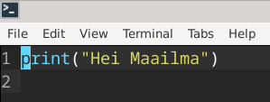

-	”print” = tulosta parametrina annettu arvo
-	’(”Hei Maailma”)’ = parametri, joka syötetään ulos ajettaessa ohjelma

Tämän jälkeen ajoin ohjelman komennolla ”python3 heiaapo.py”.

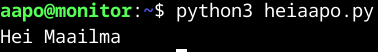

### C-kieli
**7.3.2025 Klo 13.02**  
Seuraavaksi oli C-kielen vuoro. Minulla ei ollut kokemusta lainkaan C:stä, joten turvauduin opettajan materiaaleihin (Karvinen. URL: https://terokarvinen.com/2018/hello-python3-bash-c-c-go-lua-ruby-java-programming-languages-on-ubuntu-18-04/).

Polussa */home/aapo* komento ”micro heiaapo.c”. Tiedostoon lisäsin seuraavanlaiset tiedot:

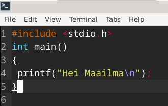

-	”#include <stdio.h>” = otsake (header), joka tässä yhteydessä lisää esiprosessikoodin tiedostoon. Esiprosessiohjelma kuuluu compileriin
-	”int main()” = pääfunktio, jossa ei ole parametrejä sulkeiden sisällä ja ”int” (integer, lukujono) kertoo funktion palautusarvon.
-	’{ printf(”Hei Maailma\n”); }’ = lauseke (statement), jossa ”printf()” funktio, jolla saadaan syöte ulos näkyviin, tässä tapauksessa merkkijono ”Hei Maailma”.
(GeeksforGeeks. URL: https://www.geeksforgeeks.org/c-language-introduction/)

-	”\n” = kursorin siirtäminen seuraavalle riville
(GeeksforGeeks. URL: https://www.geeksforgeeks.org/newline-in-c/)

Tämän jälkeen ohjelman ajaminen edellyttää tiedoston lisäämisen compileriin. Tein sen komennolla ”gcc heiaapo.c -o heiaapoc”. Valinta -o tarkoittaa, että haluan määrittää tiedoston nimen, jolla ajan ohjelmaa.  
(GeeksforGeeks. URL: https://www.geeksforgeeks.org/compiling-a-c-program-behind-the-scenes/.)

Tässä tapauksessa ”heiaapoc” tuli tiedostonimeksi.

Oli aika ajaa ohjelma polussa */home/aapo* komennolla "./heiaapoc”.

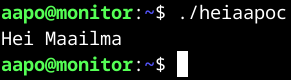

### Java
**7.3.2025 Klo 13.50**  
Kolmantena kielenä oli Javan vuoro. Javakin pitää ajaa compilerin kautta, joten samanlainen kuvio oli tiedossa kuin C:n kanssakin.

Komennolla ”micro HeiAapo.java” loin tiedoston polkuun */home/aapo*.

Lisäsin alla olevat tiedot tiedostoon:

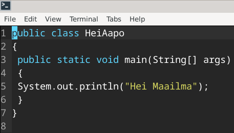

-	”public” = avoinna koko sovellukselle
-	”class HeiAapo” = luokka, jonka nimi on HeiAapo.
-	”static” = kertoo muuttujan tai metodin olevan luokka
-	”void” = metodilla ei ole paluuarvoa  
(GeeksforGeeks. URL: https://www.geeksforgeeks.org/java-keywords/)

-	”main” = metodin nimi
-	”String” = ennalta määritetty luokan nimi
-	”args” = muuttujan nimi  
(GeeksforGeeks. URL: https://www.geeksforgeeks.org/java-identifiers/)

-	’{ System.out.println(”Hei Maailma”); }’ = antaa näytölle näkyviin määritellyt parametrit.

Seuraavaksi compileriin lisääminen polussa */home/aapo* komennolla ”javac HeiAapo.java”.

Ajoin ohjelman polussa */home/aapo* komennolla ”java HeiAapo”.

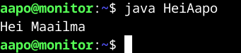

Yhtenä huomiona minulle tuli mieleen, että kurssin jälkeen voi olla viisasta poistaa kyseiset kolme ohjelmointikieltä, koska tietoturvasyistä on hyvä olla vain tarvittavat ohjelmat asennettuna.

## c)	7.3.2025 Klo 14.31
Tässä kohdassa minun tulee tehdä uusi itse tekemäni skripti, joka voidaan ajaa kaikkina käyttäjinä. Tämä tehtiin aiemmin tunnilla pikaisesti, mutta muistin virkistämiseksi luin opettajan Tero Karvisen materiaalia (Karvinen. URL: https://terokarvinen.com/2007/12/04/shell-scripting-4/).

Aloitin luomalla kotihakemistooni */home/aapo* uuden hakemiston nimeltä *scripts*. Ajoin komennon ”mkdir scripts”. Tämän jälkeen hakemistoon */home/aapo/scripts* uusi script-tiedosto komennolla ”micro lslnl”. Nimi tulee komennoista ”ls -l” ja ”nl”, joilla saan listattua hakemiston sisällön pitkässä formaatissa oikeuksineen, sekä numeroitua jokaisen rivin.

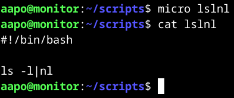

Yllä olevassa kuvassa olen avannut lisäksi cat-komennolla tiedoston sisällön, jonka lisäsin micro-editorin kautta.

**8.3.2025 Klo 13.05**  
Tiedostoon tuli alla olevan kuvan mukaiset oikeudet.

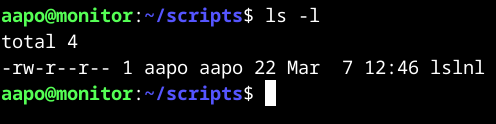

Kuvassa käyttäjällä on luku- ja kirjoitusoikeudet tiedostoon, ryhmällä ja muilla vain lukuoikeudet. Lisään komennolla ”chmod ugo+x lslnl” ajamisen oikeudet kaikille käyttäjille, koska ”u” on user, ”g” on group ja ”o” on others. Lisäksi olen listannut komennon jälkeen oikeudet tiedostoon, josta näkyy ajamisen oikeudet lisättynä x-merkistä.

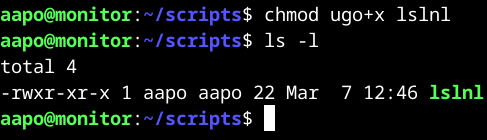

Ajoin skriptin polussa */home/aapo/scripts* komennolla ”./lslnl”.

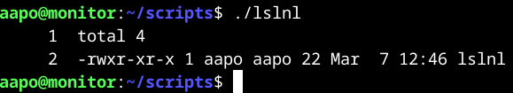

Toimi kuten pitikin, joten kopioin skriptin polkuun */usr/local/bin/* komennolla ”sudo cp lslnl /usr/local/bin/”. Näin ollen pystyn ajamaan mistä tahansa hakemistosta skriptin.

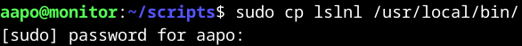

Varmistin vielä, että hakemisto oli kopioitu komennolla ”ls -l /usr/local/bin/”.

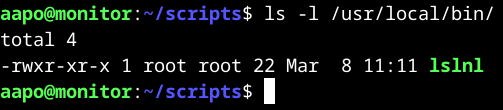

Kaikki näytti olevan kunnossa.

Kuten alla olevasta kuvasta näkyy, skriptin voi nyt ajaa mistä tahansa hakemistosta. Ajoin kyseisen komennon polusta */home*.

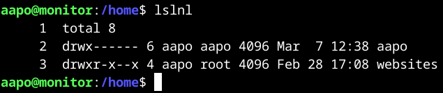

## d)	8.3.2025 Klo 13.24
D-kohdassa minun tuli suorittaa jokin vanha arvioitava laboratorioharjoitus soveltuvin osin. Valitsin Tero Karvisen sivuilta laboratorioharjoituksen linux-palvelinten kurssilta, joka oli toteutettu vuonna 2019 (URL: https://terokarvinen.com/2019/arvioitava-laboratorioharjoitus-linux-palvelimet-ict4tn021-3004-ti-alkukevat-2019-5-op/?fromSearch=linux%20palvelimet).

Tein kohdan, jossa luodaan goodmorning.sh script-tiedosto, jossa piti toivottaa hyvää huomenta, näyttää IP-osoite ja kellonaika.

Aloitin etsimällä tietoa, miten saan vain IP-osoitteen näkymään, koska esim. komento ”ip addr” antaa ulos liikaa tietoja ja rivejä. Löysinkin artikkelin GeeksforGeeks-sivuilta(URL: https://www.geeksforgeeks.org/how-to-find-your-local-ip-address-in-debian-11/).

Komento ”hostname -I” näyttää tarvittavat tiedot. Lähdin tekemään skriptiä polussa */home/aapo/scripts* komennolla ”micro goodmorning.sh”. Lisäsin tiedostoon alla olevat komennot

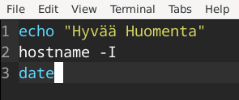

-	’echo ”Hyvää Huomenta”’ = tulostaa näytölle tekstin
-	’hostname -I’ = tulostaa näytölle IP-osoitteet
-	’date’ = näyttää päivämäärän

Oikeudet muokataan vielä komennolla ”chmod ugo+x goodmorning.sh”, jotta kaikki käyttäjät voivat ajaa skriptiä.

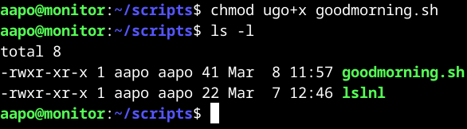

Ajoin skriptin polussa */home/aapo/scripts* komennolla ”./goodmorning.sh”.

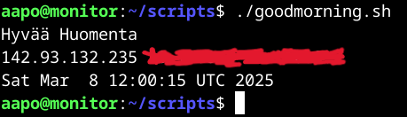

Yliviivasin tietoturvasyistä yksityiset IP-osoitteet.

Kopioin skriptin polkuun */usr/local/bin/* komennolla "sudo cp goodmorning.sh /usr/local/bin/"

Tarkastin tiedoston olemassaolon hakemistopolussa */usr/local/bin*.

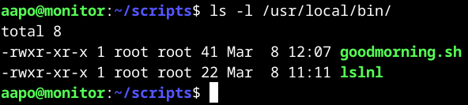

Kaikki oli kunnossa, joten taas polussa */home* ajoin skriptin komennolla ”goodmorning.sh”.

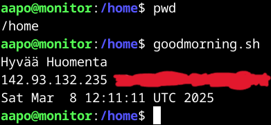

Kaikki toimi kuten pitääkin ja yliviivatut tulosteet olivat taas yksityiset IP-osoitteeni.

## Lähteet

GeeksforGeeks 6.6.2023. Newline in C. Luettavissa: https://www.geeksforgeeks.org/newline-in-c/. Luettu: 7.3.2025.

GeeksforGeeks 9.12.2024. Java Keywords. Luettavissa: https://www.geeksforgeeks.org/java-keywords/. Luettu: 7.3.2025.

GeeksforGeeks 10.1.2025. Compiling a C Program: Behind the Scenes. Luettavissa: https://www.geeksforgeeks.org/compiling-a-c-program-behind-the-scenes/. Luettu: 7.3.2025.

GeeksforGeeks 13.6.2024. How to Find Your Local IP Address in Debian 11. Luettavissa: https://www.geeksforgeeks.org/how-to-find-your-local-ip-address-in-debian-11/. Luettu: 8.3.2025.

GeeksforGeeks 20.11.2024. Java Identifiers. Luettavissa: https://www.geeksforgeeks.org/java-identifiers/. Luettu: 7.3.2025.

GeeksforGeeks 27.2.2025. C Language Introduction. Luettavissa: https://www.geeksforgeeks.org/c-language-introduction/. Luettu: 7.3.2025.

Karvinen, T. Hello World Python3, Bash, C, C++, Go, Lua, Ruby, Java – Programming Languages on Ubuntu 18.04. Luettavissa: https://terokarvinen.com/2018/hello-python3-bash-c-c-go-lua-ruby-java-programming-languages-on-ubuntu-18-04/. Luettu: 7.3.2025.

Karvinen, T. Linux Palvelimet 2025 alkukevät. Luettavissa: https://terokarvinen.com/linux-palvelimet/#h7-maalisuora. Luettu: 7.3.2025.
 
 
 
 
 
 
*Tätä dokumenttia saa kopioida ja muokata GNU General Public License (versio 3 tai uudempi) mukaisesti. http://www.gnu.org/licenses/gpl.html*  
*Pohjana Tero Karvinen 2025: Linux Palvelimet 2025 alkukevät, https://terokarvinen.com/linux-palvelimet/*
